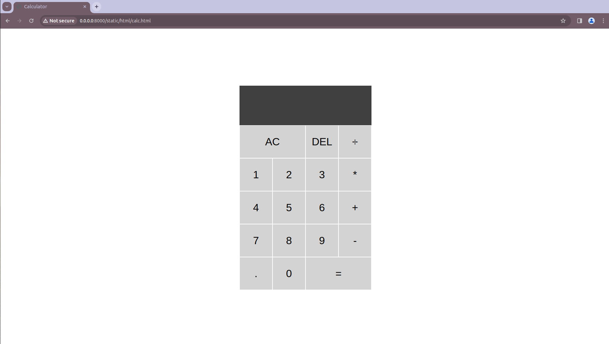
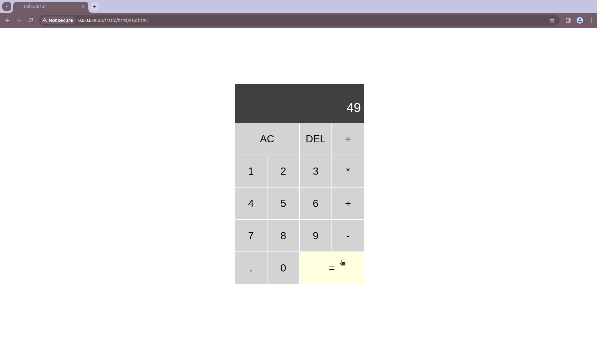

# Design of a Standard Calculator

## AIM:

To design a web application for a standard calculator.

## DESIGN STEPS:

## step 1:
Clone the github repository and create Django admin interface.

## Step 2:
Change settings.py file to allow request from all hosts.

## Step 3:
Use CSS for creating attractive colors.

## Step 4:
Write JavaScript program for implementing five different operations.

## Step 5:
Validate the HTML and CSS code.

## Step 6:
Publish the website in the given URL.
## PROGRAM :
```html
<!DOCTYPE html>
<html lang="en">
<head>
    <meta charset="UTF-8">
    <meta name="viewport" content="width=device-width, initial-scale=1.0">
    <title>Simple Calculator</title>
    <style>
        body {
            font-family: Arial, sans-serif;
            display: flex;
            align-items: center;
            justify-content: center;
            height: 100vh;
            margin: 0;
            background-color: #f8f5f5;
            flex-direction: column;
        }

        #calculator {
            border: 2px solid #ccc;
            border-radius: 5px;
            padding: 60px;
            text-align: center;
            box-shadow: 0 0 10px rgba(0, 0, 0, 0.1);
            background-color: #fd0e06;


        }

        input[type="text"] {
            width: 100%;
            padding: 10px;
            margin-bottom: 10px;
            font-size: 18px;
           
        }

        input[type="button"] {
            width: 60px;
            height: 60px;
            font-size: 25px;
            margin: 5px;
            cursor: pointer;
            border-radius: 10px;
            font-weight:bolder;
            border: 4px solid rgb(253, 252, 251);
            

        }

        input[type="button"]:hover {
            background-color: #eee;
        }

        #clear {
            background-color: green;
            color: #fff;
        }
        #display{
            margin-right: 60px;
            border: 4px solid black;
        }
      .name{
        margin-bottom: 50px;
      }
    </style>
</head>
<body>

<div id="calculator">
   
    <input type="text" id="display" >
    <br><br><br>
    <input type="button" value="7" onclick="addToDisplay('7')">
    <input type="button" value="8" onclick="addToDisplay('8')">
    <input type="button" value="9" onclick="addToDisplay('9')">
    <input type="button" value="/" onclick="addToDisplay('/')">
    <br>
    <input type="button" value="4" onclick="addToDisplay('4')">
    <input type="button" value="5" onclick="addToDisplay('5')">
    <input type="button" value="6" onclick="addToDisplay('6')">
    <input type="button" value="-" onclick="addToDisplay('-')">
    <br>
    <input type="button" value="1" onclick="addToDisplay('1')">
    <input type="button" value="2" onclick="addToDisplay('2')">
    <input type="button" value="3" onclick="addToDisplay('3')">
    <input type="button" value="+" onclick="addToDisplay('+')">
    <br>
    <input type="button" value="0" onclick="addToDisplay('0')">
    <input type="button" value="." onclick="addToDisplay('.')">
    <input type="button" id="clear" value="C" onclick="clearDisplay()">
    <input type="button" value="=" onclick="calculate()">
</div>

<script>
    function addToDisplay(value) {
        document.getElementById('display').value += value;
    }

    function clearDisplay() {
        document.getElementById('display').value = '';
    }

    function calculate() {
        try {
            document.getElementById('display').value = eval(document.getElementById('display').value);
        } catch (error) {
            document.getElementById('display').value = 'Error';
        }
    }
</script>

</body>
</html>
```

## OUTPUT:



## Result:

ence,